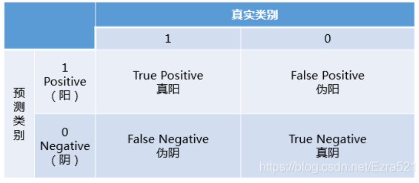

## 图像分类指标

### 1. 混淆矩阵

    - TP: 真阳，预测为阳性，标签为阳
    - TN: 真阴，预测为阴性，标签为阴
    - FP: 假阳，预测为阳性，标签为阴
    - FN: 假阴，预测为阴性，标签为阳
### 评价分类指标
1. 准确率 Accura
`Acc = (TP+TN) / (TP+TN+FP+FN)`
    - 分子：预测正确的数量
    - 分母: 总样本数量
    - 意义: 预测正确的结果占总样本的比例。考量分类器对所有类别的分类能力
2. 精确率/查准率 Precision
`Precision = TP / (TP + FP)`
    - 分子：预测阳性正确的数量
    - 分母: 预测为阳性的总数量
    - 意义：在预测为阳性的样本中，预测正确的比例。考量分类器在某一类的误检
3. 召回率/查全率 Recall
`Recall = TP / (TP + FN)`
    - 分子：预测阳性正确的数量
    - 分母: 标签为阳性的总数量
    - 意义：在标签为阳性的样本中，预测正确的比例。考量分类器在某一类的漏检
4. F1 Score
`f1 = 2PR/(P+R)`
    - 通常情况Precision高，Recall就低。P低R就高。所以使用f1综合考虑两者
    - 意义: Precision和Recall的调和均值，综合考虑查准和查全。
5. TPR和FPR
`TPR = TP/(TP+FN)`
    - 分子：预测阳性正确的数量
    - 分母: 标签为阳性的总数量
    - 意义：在所有阳性的样本中，预测阳类正确的比例。考量分类器在某一类的漏检，即召回率。
`FPR = FP/(FP+TN)`
    - 分子：阴性预测为阳性的数量
    - 分母: 标签为阴性的总数量
    - 意义：在所有阴性的样本中，预测为阳类的比例。越小越好

6. ROC曲线
    - (receiver operating characteristic curve，接收者操作特征曲线)
    - 以FPR为x轴，TPR为y轴的曲线
    - 不同的分类threshold，得到的TP、TN、FN、FP不同，从而FPR和TPR不同，所以一个threshold可以得到(fpr, tpr)

7. AUC
    - ROC曲线下面积，0-1， 0.5表示随机，1最好。
    - 另一种定义更常用：分别随机从正负样本集中抽取一个正样本，一个负样本，正样本的预测值大于负样本的概率。
    - 上述图片中：AUC=1，表示所有正样本在负样本之前，即可以找到一个阈值，将所有正负样本分开。AUC=0.8时，表示有80%正类在负类前。即可以找到一个阈值，可以将80%正样本和负样本分开。
    - 同时考虑了分类器对正类和负类的分类能力，这样在样本不平衡的情况下仍可以做出合理的评价

8. PR曲线
    - 以Recall为x轴，Precision为y轴的曲线
    - 类别不平衡问题中由于主要关心正例，所以在此情况下PR曲线被广泛认为优于ROC曲线
9. mAP、AP
    - AP就是Precision-recall 曲线下面的面积，通常来说一个越好的分类器，AP值越高。
    - mAP是多个类别AP的平均值。这个mean的意思是对每个类的AP再求平均，得到的就是mAP的值，mAP的大小一定在[0,1]区间，越大越好。该指标是目标检测算法中最重要的一个。