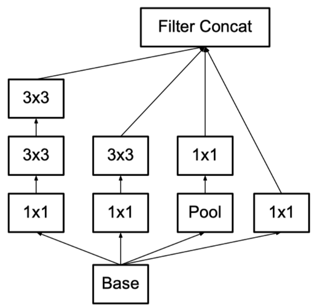

## 图像分类指标
### 改进思路1：加深宽度(通道数)+深度(网络层数)
### 1. LeNet
    - 5层网络，3层卷积+2层全连接

### 2. AlexNet
    - 8层网络，5层卷积+3层全连接
    - 第一层使用11x11大卷积核
    - sigmoid换成relu
    - 使用dropout

### 3. VGG
    - VGG11，8层卷积(5个卷积块，3个双+2个单)+3层全连接
    - 有可重复使用的vgg block(卷积+池化)

### 改进思路2：减少参数量
### 4.Nin
    - 使用1x1的卷积代替全连接
    - nin块 串联连接（1个卷积+2个1x1的卷积)
    - 相比AlexNet，同样使用了大卷积核，11，5，3。但是去除后面全连接，改用nin块，输出通道=类别数，使用全局平均池化获得输出。可以减少模型参数尺寸。

### 5.1 GoogLeNet - Inception v1
- 使用Inception块(包含4条线路)，前3条抽取不同空间尺寸大小的信息，第2，3条中1x1卷积核用于减少输入通道数。池化层(保留显著特征)
    - p1：1x1卷积核
    - p2：1x1卷积核 + 3x3卷积核
    - p3： 1x1卷积核 + 5x5卷积核
    - p4：3x3最大池化 + 1x1卷积核
- 模型参数小，计算复杂度低

### 5.2 Inception v2
- 在v1的基础上
    - 卷积核激活函数之间使用了BN
    - 用2个3x3替换5x5

### 6.ResNet
- 使用残差块,resnet18和resnet34使用basic block(2个3x3)，resnet50和renset101使用bottleneck block(2个1x1和1个3x3)，1x1卷积减少通道数，降低计算量

- 各个模型使用的残差块

- 优点：缓解梯度消失和梯度爆炸
- 层数计算: 1 (7x7) + block nums*block conv nums + 1(fc)

### 7.DenseNet

- 建立前面层和后面层的密集连接，在通道上拼接实现特征重用。
- Dense block 和 Transition（过渡层）
    - Dense Basic block：BN-ReLU-3x3Conv
    - Dense Bottleneck block: BN-ReLU-1x1Conv +  BN-ReLU-3x3Conv
    - Transition Layer: 1x1Conv-pool。1x1Conv：减小通道数，去除冗余信息，pool：减小特征图大小
- Resnet是相加，Dense是通道上拼接。

### 8.EfficientNet
- 同时增加网络的width，depth和输入图像的分辨率提升网络的性能
- MBConv结构：类似MobileNet中的InvertedResidualBlock，改用Swish激活函数，加入SE(Squeeze and Excitation)模块(GAP变成1x1xc，通过2个fc，在和原来特征逐通道加权)
## 轻量化网络
## SequeezeNet
- 基于AlexNet
- 设计思想：
    1. 1x1卷积代替3x3卷积
    2. 减小3x3卷积的输入通道数
    3. 延迟降采用
## MobileNet
- 基于VGG
- v1设计思想：
    1. 深度可分离DW卷积代替传统卷积
    2. 使用stride=2的卷积代替池化。提升运行速度。
- v2设计思想：
    1. 使用Inverted Residuals，扩充通道提取更多特征
        - Residual block：1x1卷积降维+3x3卷积+1x1卷积升维
        - Inverted Residual block：1x1卷积升维+3x3DW卷积+1x1卷积降维
    2. 在residual block的element-wise sum之前的1x1卷积不用ReLU，避免ReLU对特征进行破坏
## Xception
- 基于 Inception v3
- 设计思想：
    1. 深度可分离DW卷积和点卷积PW代替传统卷积
## ShuffleNet
- 基于 MobileNet
- 设计思想：
    1. 采用组卷积，减少大量参数
        - 组卷积核深度可分离卷积DW存在通道间“信息交流不流通”问题
    2. 采用channel shuffle解决上述问题
        - MobileNet使用点卷积PW解决，ShuffleNet采用channel shuffle