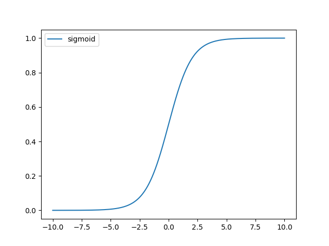
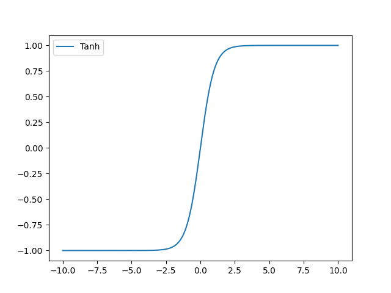
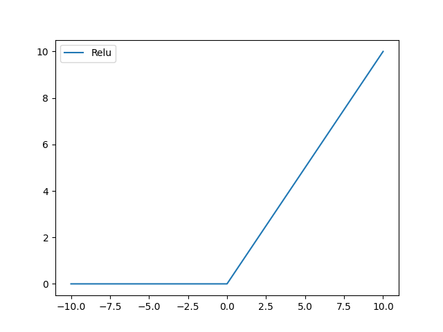
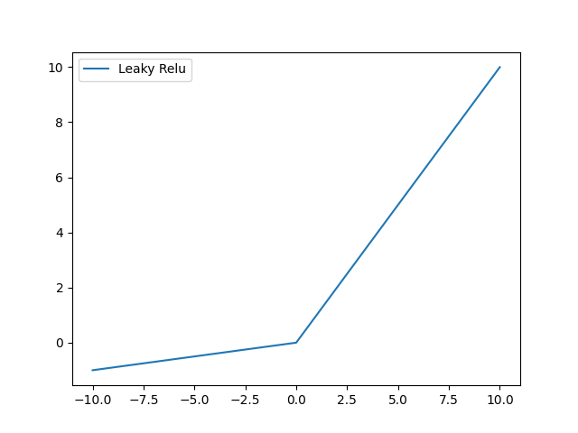

# 激活函数 
- 作用：激活函数可以把当前特征空间映射转换到另一个空间，让数据能够更好的被分类。引入非线性变换，加强网络的表达能力。
- 性质：
    1. 非线性： 当激活函数是非线性的，一个两层的神经网络就可以基本上逼近所有的函数。如果 MLP 使用的是线性的激活函数，那么整个网络和单层神经网络是等价的；
    2. 可微性： 优化更新基于梯度下降；
    3. 单调性： 当激活函数是单调的时候，单层网络能够保证是凸函数(只有一个极值点，极值点就是最值点)；

1. Sigmoid
- Sigmoid函数公式如下，由图可知，Sigmoid激活函数的输出在0到1之间，因此可以置于网络最后一层用于概率预测。但是，在输入很大或者很小时梯度较小，易出现梯度消失。使用指数运算并且不以0为中心，相较于其他激活函数，执行效率较慢并且影响反向传播效率。
- 函数的定义为：$ f(x) = \frac{1}{1 + e^{-x}} $，其值域为 $ (0,1) $。

2. Tanh
- 双曲正切激活函数公式如下，由图可知，其曲线和Sigmoid函数相似。但是在输入较大或较小时，其梯度相比Sigmoid更小，不利于权重更新。但是双曲正切函数以0为中心，其权重更新效率比Sigmoid更高，但是仍然没有解决Sigmoid函数存在的梯度消失问题。
- 函数的定义为：$ f(x) = tanh(x) = \frac{e^x - e^{-x}}{e^x + e^{-x}} $，值域为 $ (-1,1) $。

3. ReLU
- ReLe激活函数在神经网络较为常用，公式如下，由图可知，该函数是一个分段函数，当输入值大于0时，函数的梯度始终存在，所以不存在梯度饱和问题，缓解了梯度消失问题。由于其仅涉及线性计算，无指数级计算，因此其计算速度比Sigmoid和Tanh更快。
- 单侧抑制和稀疏激活性：ReLU 函数从图像上看，是一个分段线性函数，把所有的负值都变为 0，而正值不变，这样就成为单侧抑制。因为有了这单侧抑制，才使得神经网络中的神经元也具有了稀疏激活性，即神经元同时只对输入信号的少部分选择性响应，大量信号被刻意的屏蔽了，更好更快地提取稀疏特征。
- 函数的定义为：$ f(x) = max(0, x) $  ，值域为 $ [0,+∞) $；

4. LeakyReLU
- 在ReLU中，当输入值小于0时，其梯度始终为0，阻碍网络的训练。因此，提出LeakyReLu，主要解决ReLu激活函数中梯度始终为0的问题。如公式，其中$\lambda$表示一个很小的参数(图中$\lambda$为0.1)。其曲线图如图。为了解决梯度为0的问题，赋予其一个很小的权重，使其能够参与网络的更新
-    函数定义为： $ f(x) =  \left\{
   \begin{aligned}
   \lambda x, \quad x<0 \\
   x, \quad x>0
   \end{aligned}
   \right. $，值域为 $ (-∞,+∞) $。 

5. Softmax
- Softmax激活函数的公式如下，其中$x_i$表示属于第$i$类的预测值，$n$表示类别数量。该激活函数将预测值全部映射到0到1之间，与Sigmoid函数不同，该函数的所有输出之和为1。通常用于分类的概率预测。
- 函数定义为： $ \sigma(x)_i = \frac{e^{x_i}}{\sum_{k=1}^K e^{x_k}} $。

6. 导数

| 原函数          | 函数表达式                                   | 导数                                                         | 备注                                                         |
| --------------- | -------------------------------------------- | ------------------------------------------------------------ | ------------------------------------------------------------ |
| Sigmoid激活函数 | $f(x)=\frac{1}{1+e^{-x}}$                    | $f^{'}(x)=\frac{1}{1+e^{-x}}\left( 1- \frac{1}{1+e^{-x}} \right)=f(x)(1-f(x))$ | 当$x=10$,或$x=-10​$，$f^{'}(x) \approx0​$,当$x=0​$$f^{'}(x) =0.25​$ |
| Tanh激活函数    | $f(x)=tanh(x)=\frac{e^x-e^{-x}}{e^x+e^{-x}}$ | $f^{'}(x)=1-(tanh(x))^2$                                      | 当$x=10$,或$x=-10$，$f^{'}(x) \approx0$,当$x=0$$f^{`}(x) =1$ |
| Relu激活函数    | $f(x)=max(0,x)$                              | $c(u)=\begin{cases} 0,x<0 \\ 1,x>0 \\ undefined,x=0\end{cases}$ | 通常$x=0$时，给定其导数为1和0                                |

## Reference

https://github.com/scutan90/DeepLearning-500-questions