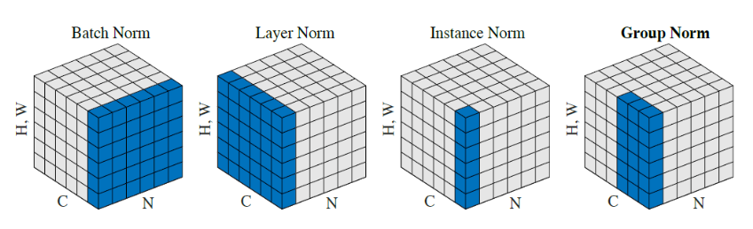

# 归一化-Normalization
- 作用：
    1. 为了后面数据处理的方便，归一化的确可以避免一些不必要的数值问题。
    2. 加快收敛。特征量纲不一致(0-10和0-100)，导致梯度更新时会偏好某一个特征。
    3. 同一量纲。样本数据的评价标准不一样，需要对其量纲化，统一评价标准。
    4. 避免神经元饱和。啥意思？就是当神经元的激活在接近 0 或者 1 时会饱和，在这些区域，梯度几乎为 0，这样，在反向传播过程中，局部梯度就会接近 0，这会有效地“杀死”梯度。
    5. 保证输出数据中数值小的不被吞食。 
- 类型

    1. 线性归一化
        - 适用范围：比较适用在数值比较集中的情况。
        - 缺点：如果 max 和 min 不稳定，很容易使得归一化结果不稳定，使得后续使用效果也不稳定。
    $$
    x^{\prime} = \frac{x-min(x)}{max(x) - min(x)}
    $$

    2. 标准差标准化
        - 含义：经过处理的数据符合标准正态分布，即均值为 0，标准差为 1 其中 $ \mu $ 为所有样本数据的均值，$ \sigma $ 为所有样本数据的标准差。
    $$
    x^{\prime} = \frac{x-\mu}{\sigma}
    $$
    3. 非线性归一化

        - 适用范围：经常用在数据分化比较大的场景，有些数值很大，有些很小。通过一些数学函数，将原始值进行映射。该方法包括 $ log $、指数，正切等。
## 批归一化-Batch Normalization
- 以前在神经网络训练中，只是对输入层数据进行归一化处理，却没有在中间层进行归一化处理。要知道，虽然我们对输入数据进行了归一化处理，但是输入数据经过 $ \sigma(WX+b) $ 这样的矩阵乘法以及非线性运算之后，其数据分布很可能被改变，而随着深度网络的多层运算之后，数据分布的变化将越来越大。如果我们能在网络的中间也进行归一化处理，是否对网络的训练起到改进作用呢？答案是肯定的。 

- 这种在神经网络中间层也进行归一化处理，使训练效果更好的方法，就是批归一化Batch Normalization（BN）。
- 下面我们来说一下BN算法的优点： 
    1. 减少了人为选择参数。在某些情况下可以取消 dropout 和 L2 正则项参数,或者采取更小的 L2 正则项约束参数； 
    2. 减少了对学习率的要求。现在我们可以使用初始很大的学习率或者选择了较小的学习率，算法也能够快速训练收敛； 
    3. 可以不再使用局部响应归一化。BN 本身就是归一化网络(局部响应归一化在 AlexNet 网络中存在) 
    4. 破坏原来的数据分布，一定程度上缓解过拟合（防止每批训练中某一个样本经常被挑选到，文献说这个可以提高 1% 的精度）。 
    5. 减少梯度消失，加快收敛速度，提高训练精度。
- 使用场景
    - 在CNN中，BN应作用在非线性映射前。在神经网络训练时遇到收敛速度很慢，或梯度爆炸等无法训练的状况时可以尝试BN来解决。另外，在一般使用情况下也可以加入BN来加快训练速度，提高模型精度。
    - BN比较适用的场景是：每个mini-batch比较大，数据分布比较接近。在进行训练之前，要做好充分的shuffle，否则效果会差很多。另外，由于BN需要在运行过程中统计每个mini-batch的一阶统计量和二阶统计量，因此不适用于动态的网络结构和RNN网络。

## Layer Normalization
- 克服BN对批大小的限制

## Reference

https://github.com/scutan90/DeepLearning-500-questions