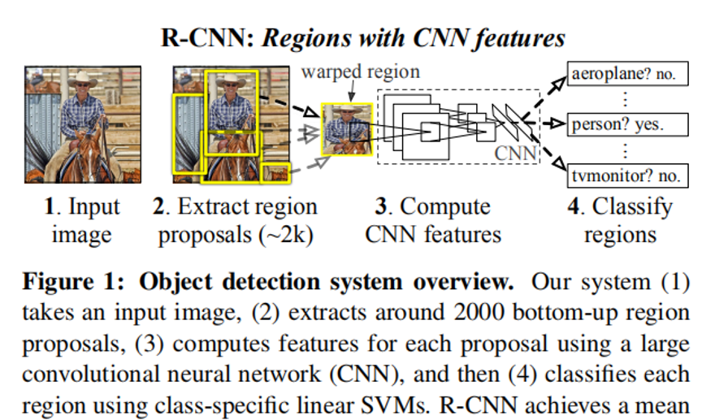
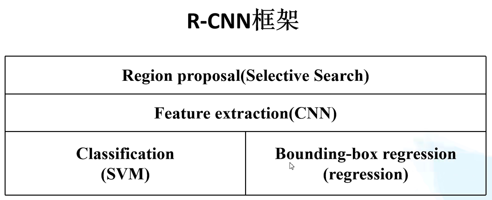

## R-CNN (Region with CNN feature)
### 算法流程
1. 一张图像生成1k-2k个候选区域，提出区域，使用Selective Search算法(首先获得初始区域的划分，计算相似度(纹理尺寸形状颜色)最大合并，直到整张图变为1个区域)
2. 对每个候选区域，使用CNN(AlexNet)提取特征(4096维)
3. 特征送到每一类的SVM分类器中，判断是否属于该类
4. 回归器精修修正候选框的位置

### RCNN存在问题
1. 测试速度慢，使用SS算法提取候选框慢，候选框存在大量重叠，并且都需要进行特征提取操作
2. 训练速度慢，过程繁琐（SVM单独训练，回归器训练）
3. 训练所需空间大，每张图像的每个候选框的特征要写入磁盘
## 非极大值抑制剔除重叠候选框
    首先，寻找置信度最高的目标，计算其他目标与该目标的IoU值，剔除IoU大于给定阈值的目标