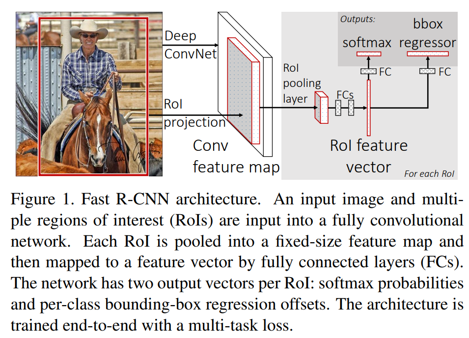
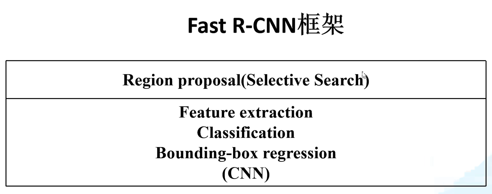

## Fast R-CNN
### 算法流程
1. 一张图像生成1k-2k个候选区域，使用Selective Search算法
2. 将图像输入网络得到相应的**特征图**，将SS算法生成的候选框(不是所有)投影到特征图中获得相应的**特征矩阵**
3. 将每个特征矩阵通过ROI pooling层缩放到**7x7大小的特征图**，接着将特征图展平通过一系列的全连接层得到预测结果

### multi-task loss
分类损失+边界框回归损失

### 改进以及存在问题
1. 训练和测试速度相较与RCNN都有提高
2. 使用SS选择候选框时间长的问题没有解决