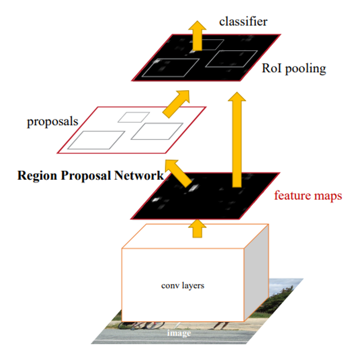
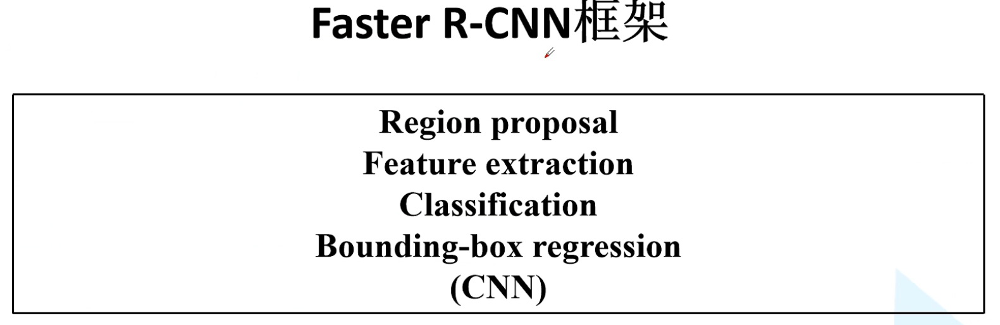
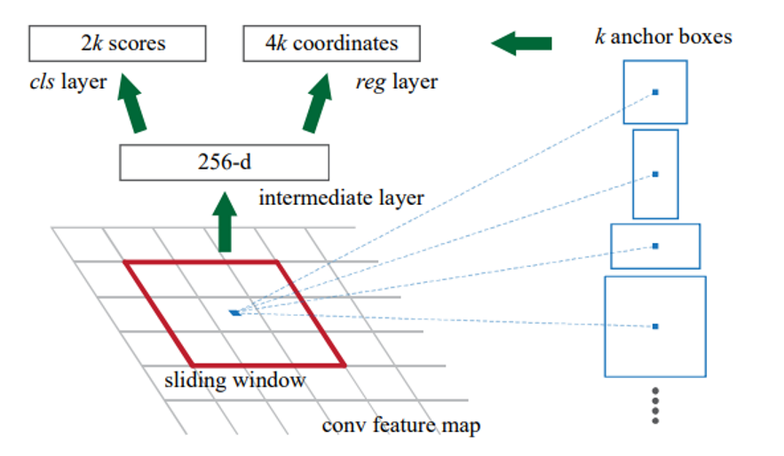
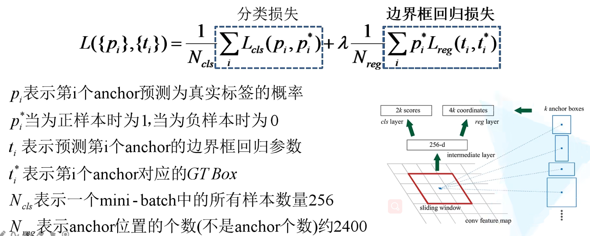

## Faster R-CNN
### 算法流程
1. 将图像输入到完了过得到相应的**特征图**
2. 使用RPN结构生成候选框，将生成的候选框投影到特征图上获得相应的**特征矩阵**
3. 将每个特征矩阵通过ROI pooling层缩放到**7x7大小的特征图**，接着将特征图展平通过一系列的全连接层得到预测结果

### RPN网络

    计算每个3x3滑动窗口的中心点对应原RGB图的中心点，并生成k(原论文k=9)个anchor boxes(不同与proposals)，每个中心点生成3种尺度(128x128, 256x256, 512x512)和3种(宽高)比例(1:1, 1:2, 2:1)，也就是说每个滑动窗口在原图都对应有9个anchor boxes。
### 训练数据的采样，正负样本
1. anchor数量：一张图片随机选取256个anchors来计算一个batch的损失，其中正负样本的比例保持1：1，如果正样本少于128个，负样本补齐，即正样本101个，负样本取256-101个
2. 正负样本定义
    - 根据anchor和GT的IoU大于0.7为正样本
    - 与gt的IoU值最大的一个anchor为正样本(这样IoU可以小于0.7，是第一条的补充)
    - 根据anchor和GT的IoU小于0.3为负样本，其余舍去
### multi-task loss
分类损失+边界框回归损失
其中pi表示预测为有obj的概率

### faster rcnn训练
1. 现在：采用RPN loss + Fast R-CNN loss的联合训练方法
2. 原论文，采用分别训练RPN和Fast R-CNN的方法
    - imagenet预训练分类模型初始化前置卷积网络层参数，并单独训练RPN
    - 固定RPN参数，再利用imagenet预训练分类模型初始化前置卷积网络层参数，并利用RPN生成的目标建议框去训练Fast R-CNN参数
    - 固定Fast RCNN的参数，去微调RPN独有的卷积层和全连接层参数
    - 固定前置卷积的参数，微调Fast RCNN的全连接层
### 改进以及存在问题
1. 简化候选框的生成