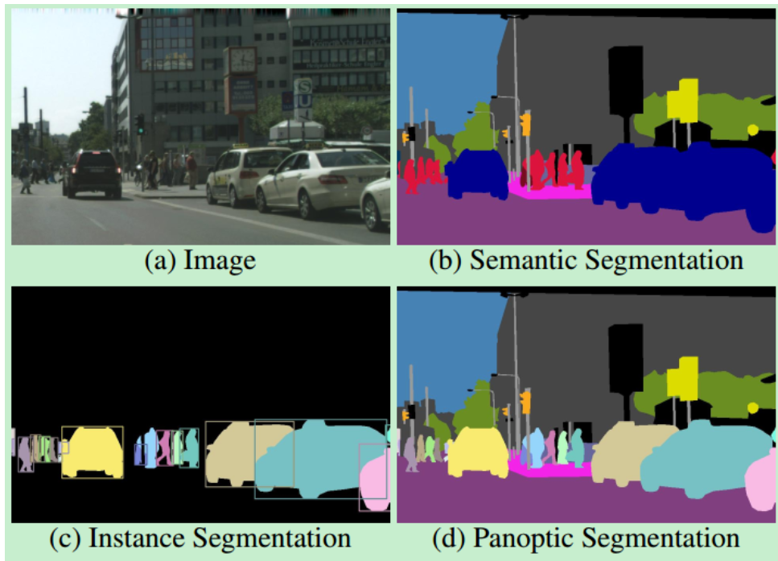
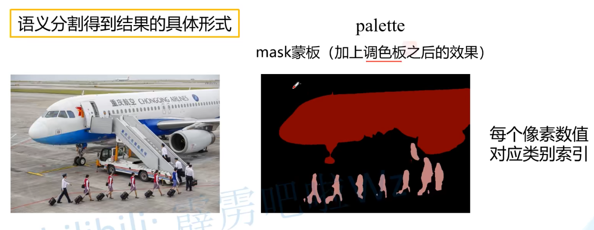
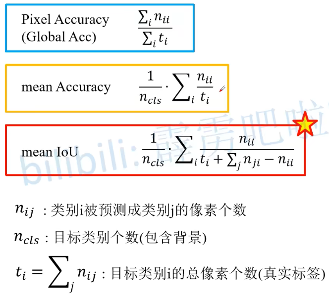

### 常见分割任务
1. 语义分割 (Semantic segmentation)   FCN
    对每个像素点进行分类，同一类别使用相同颜色标注
2. 实例分割 (Instance segmentation)   Mask R-CNN
    目标检测和语义分割的结合
    对每个像素点进行分类，同一类别的不同目标使用不同颜色标注
3. 全景分割 (Panoramic segmentation)  Panotic FPN
    语义分割和实例分割的结合

### 数据集格式
1. PASCAL VOC
    PNG图片(P模式)
2. COCO
    目标的多边形坐标(polygons)

### 语义分割结果的具体形式
    实际上是单通道的图片，像素值为对应类别索引，加上调色板之后才显示下图

### 语义分割评价指标
